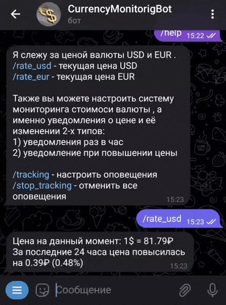

# _Telegram-bot для мониторинга Доллара(USD) и Евро(EUR)_
***
Бот предоставляет простую систему мониторинга стоимости валюты, доступны следующие типы оповещений:
* Ежечасное оповещение с указанием цены и ее изменение
* Оповещение при достижении валютой определенной стоимости
---

## Доступные команды 
  
* __/help__ - краткое описание команд бота
  
* __/rate_usd__ - информация о текущей стоимости USD
  
* __/rate_eur__ - информация о текущей стоимости EUR  
  
* __/tracking__ - настройка режимов оповещения о стоимости валюты
  
* __/stop_tracking__ - выключение всех режимов оповещения

  (Вся информация берется с сайта https://bankiros.ru/currency)